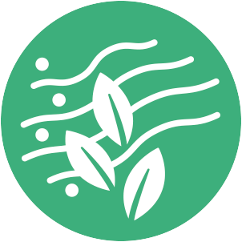
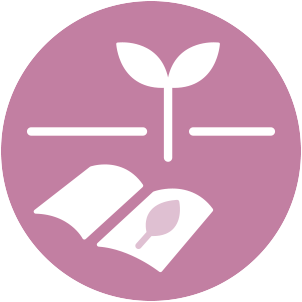
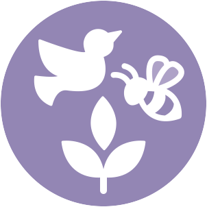

# Ikoner for urbane økosystemtjenester (NO)

Ikoner for urbane økosystemtjenester ble utviklet for Bymiljøetaten i Oslo kommune i prosjektet Fremtidens Byer. Ikonene er utviklet for kommunikasjon om økosystemtjenester med befolkningen og andre sektorer.

Ikonene er tilgjengelige for nedlasting **[her](https://github.com/NINAnor/trekroner-docs/tree/main/ES_icons)** og de kan brukes av andre kommuner og organisasjoner.

 

## 1. Regulerende tjenester

### Pollinering og frøspredning

 

 

### Vannhåndtering

 

 

### Motvirke erosjon

 

 

### Lokal klimaregulering

 

 

### Rensing av vann

 

 

### Rensing av jord

 

 

### Rensing av luft

 

 

### CO2-opptak og lagring

 

 

### Støyreduksjon

 

 

## 2. Forsynende tjenester

### Matproduksjon

 

 

### Kunst/leketøy

 

 

### Friskt vann

 

 

## 3. Kunnskaps- og opplevelsestjenester

### Rekreasjon, mental og fysisk helse

 

 

### Estetikk

 

 

### Turisme

 

 

### Utdanning og kognitiv utvikling

 

 

### Stedsidentitet og kulturarv

 

 

## 4. Støttende tjenester

### Habitat for truede arter

 

 

### Biologisk mangfold

 

 

