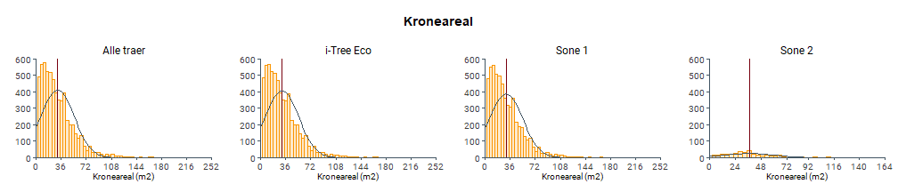
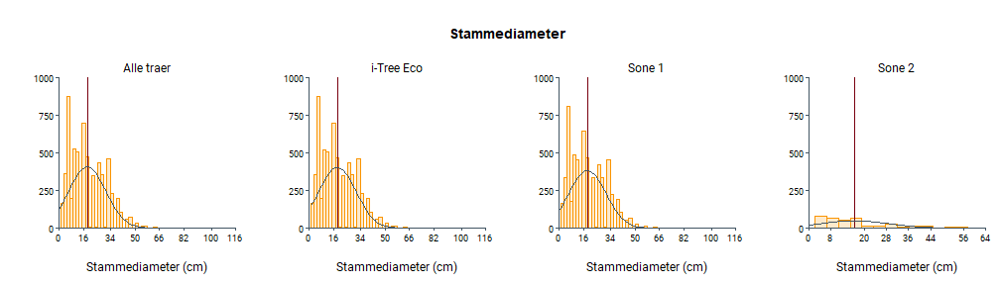
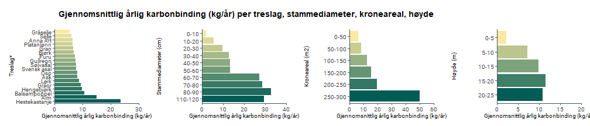
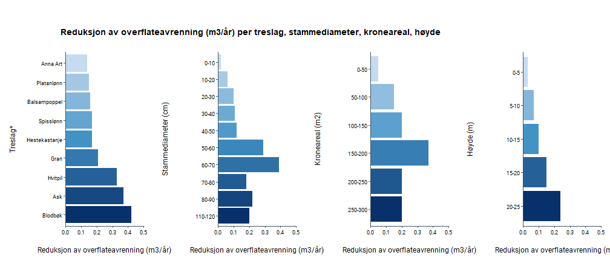

# Bodø sammendragsstatistikk

## Registrerte trær i Bodø's byggesonen

Dette dokumentet viser sammendragstatistikken for registrerte trær innenfor Bodø's byggesone. Tilknyttede kartprodukter er synlige i bytræratlaset: [Bytræratlas Bodø](https://experience.arcgis.com/experience/5191adc2c4b34658aea227c9853c6ebb/)

| Gruppe                 | Beskrivelse                                            | Antall             |
|------------------|------------------------------------|------------------|
| Totalt registerte trær | Totalt antall registrerte trær i Bodø | 6184       |
| i-Tree Eco             | Totalt antall trær brukt i i-Tree Eco                  | 6 131 |
| Sone 1                 | Trær i forurensnings sone 1 (grønn)                    | 5 813    |
| Sone 2                 | Trær i forurensnings sone 2 (gull)                     | 371    |
| Sone 3                 | Trær i forurensnings sone 3 (rød)                      | 0    |
| Totalt trebestand      | Totalt antall trær i bestanden (basert på laserdata)   | 103 738     |

 

## Treslagsfordeling i Bodø

 

### Tre egenskaper

 

### Regulerende økosystemtjenester

\*Treslag med gjennomsnittlig karbonlagring \< 100 kg vises ikke i plottet. 

\*Treslag med årlig karbonbinding \< 5 kg/år vises ikke i plottet. 

\*Treslag med CO2-utslipp unngått \< 5 kg/år vises ikke i plottet. 

\*Treslag med gjennomsnittlig reduksjon av overflateavrenning \< 0.1 m3/år vises ikke i plottet. 

\*Treslag med gjennomsnittlig reduksjon av luftforurensing \< 25 g/år vises ikke i plottet. 

 

*Dette dokumentet er en del av prosjektet:*

**TREKRONER Prosjektet** \| Trærs betydning for klimatilpasning, karbonbinding, økosystemtjenester og biologisk mangfold.
