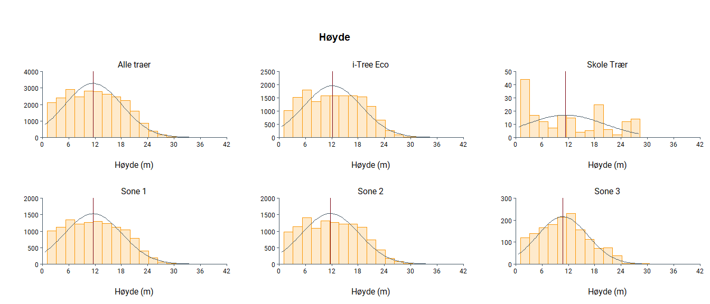
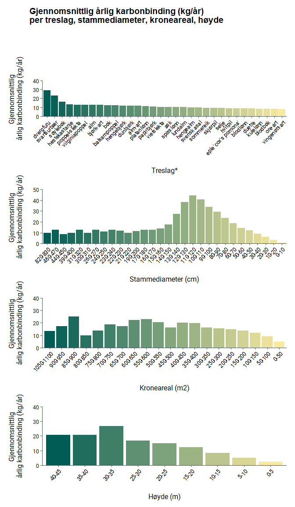
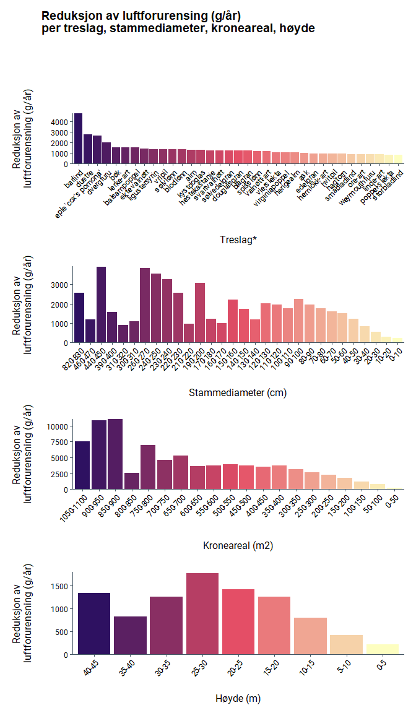

### Registrerte trær i Oslo’s byggesonen

Dette dokumentet viser sammendragstatistikken for registrerte trær
innenfor Oslo’s byggesone. Tilknyttede kartprodukter er synlige i
bytræratlaset: [Bytræratlas
Oslo](https://experience.arcgis.com/experience/%60r%20params$agol%60/)

| Gruppe                 | Beskrivelse                                          | Antall            |
|-------------------|-----------------------------------|-------------------|
| Totalt registerte trær | Totalt antall registrerte trær i Oslo                | 29928             |
| i-Tree Eco             | Totalt antall trær brukt i i-Tree Eco                | 16198             |
| Skoletrær              | Totalt antall trær plassert i undervisningsområde    | 221 (i-Tree = 27) |
| Sone 1                 | Trær i forurensnings sone 1 (grønn)                  | 14339             |
| Sone 2                 | Trær i forurensnings sone 2 (gull)                   | 13929             |
| Sone 3                 | Trær i forurensnings sone 3 (rød)                    | 1772              |
| Totalt trebestand      | Totalt antall trær i bestanden (basert på laserdata) | 633282            |

 

### Treslagsfordeling i Oslo

Treslag som har en sannsynlighet på mindre enn 2% er klassifisert som
“Andre treslag”.

\*Treslag klassifisert som ‘Andre treslag’
er: agnbøk, alm-art, amurkorktre, ask raywood, asklønn, balsampoppel,
barlind, barlind-art, bjørkekirsebær, blodbøk, blodlønn, blodlønn
crimson king, blågran, bøk, douglasgran, duetre, dvergfuru, edelgran,
edelgran-art, edelkastanje, eike-art, einer, ekte valnøtt, eple
‘alexander’, eple ‘aroma’, eple ‘beauty of bath’, eple ‘charlamovsky’,
eple ‘charles ross’, eple ‘cox’s pomona’, eple ‘fuhr’, eple
‘gravenstein’, eple ‘gul richard’, eple ‘haugmann’, eple ‘hvit
astrakan’, eple ‘ingrid marie’, eple ‘james grieve’, eple ‘july red’,
eple ‘kaniker’, eple ‘karin schneider’, eple ‘katinka’, eple ‘lobo’,
eple ‘ribston’, eple ‘rød gravenstein’, eple ‘rød ribston’, eple ‘rød
sævstaholm’, eple ‘rød torstein’, eple ‘signe tillisch’, eple
‘summerred’, eple ‘sævstaholm’, eple ‘torstein’, eple ‘transparente
blanche’, eple ‘worcester pearmain’, eple ‘åkerø’, eple-art,
fuglekirsebær, furu, furu-slekta, gran, gran-slekta, gråor, gråpoppel,
gudetre, gullpil, gullregn, gullregn-art, hagtorn, hagtorn-art, hassel,
hassel-art, hegg, hemlokk-art, hengealm, hengeblodbøk, hengebøk,
hestekastanje-art, himalayabjørk, hjertetre, hvitpil, japankirsebær,
japankisebær, japanrogn, kirsebær, kirsebærbladet hagtorn,
koloradoedelgran, koreaedelgran, krimlind, kulekirsebær, kulelønn,
kystdoglas, lerk, lerke-art, ligustersyrin, londonplatan, lundalm, lønn,
lønne-art, magnolia-art, mannaask, morell, naverlønn, neverhegg,
nordmannsedelgran, ore-art, oregoneik, ornäsbjørk, osp, papirbjørk,
parkhagtorn, parklind, plomme, plomme ‘althans’, plomme ‘herman’, plomme
‘opal’, plomme ‘reine claude d’oullins’, plomme ‘reine claude grønn’,
plomme ‘victoria’, plomme-art, poppel-slekta, prydeple, pære, pære
‘anna’, pære ‘bergamott’, pære ‘clapp’s favorite’, pære ‘clara frijs’,
pære ‘esperens herrepære’, pære ‘gråpære’, pære ‘herzogin elsa’, pære
‘ingeborg’, pære ‘moltke’, pære-art, rogn, rognasal, rogne-art, rød
hestekastanje, rødbøk, rødeik, sargentkirsebær, selje, sembrafuru,
serbergran, sibirlerk, sibirlønn, silkefuru, silkepil, sitkagran,
skarlageneik, skjørpil, smørvalnøtt, snømagnolia, sommereik, spansk
edelgran, storbladlind, storrobinia, sukkerlønn, sumpeik, surkirsebær,
svartfuru, svartor, svartsurbær, svartvalnøtt, svensk asal, syrin-art,
sølvasal, sølvedelgran, sølvlind, sølvlønn, sørgjepil, søtkirsebær,
søyleagnbøk, søylebøk, søyleeik, søyleosp, søylesvartor, tempeltre,
thuringerrogn, tokyokirsebær, tulipantre, tyrkisk hassel, tysk asal,
ungarsk syrin, urtidstre, valnøtt-art, vierslekta, vingenøtt,
vingenøtt-art, vintereik, virginiapoppel , vripil, weymouthfuru,
østamerikansk thuja 

 

### Tre egenskaper

------------------------------------------------------------------------

 

|Treslag                         | Antall Trær| Kroneareal (m2)| Høyde (m)| Stammediameter (cm)|
|:-------------------------------|-----------:|---------------:|---------:|-------------------:|
|                                |          26|           40.71|      6.14|               13.00|
|agnbøk                          |          31|           41.36|      6.59|               19.02|
|alm                             |        1092|          130.00|     16.13|               48.90|
|alm-art                         |         171|           91.75|     13.57|               43.98|
|amurkorktre                     |           6|           26.13|      4.91|               14.87|
|ask                             |         385|          127.85|     15.13|               43.15|
|asklønn                         |           2|          113.40|      6.81|               25.20|
|balsampoppel                    |           4|          147.23|     21.53|               49.98|
|barlind                         |           1|          232.35|      9.16|               24.84|
|barlind-art                     |           1|           10.47|      1.17|               18.46|
|bjørk-art                       |         792|           78.63|     14.46|               35.59|
|bjørkekirsebær                  |           3|           31.12|      2.67|                5.52|
|blodbøk                         |           3|          127.90|     10.90|               27.76|
|blodlønn                        |           6|           65.92|     11.98|               30.09|
|blodlønn crimson king           |          16|           27.10|      6.38|               18.14|
|blågran                         |          27|           60.78|     12.09|               29.95|
|bøk                             |          98|          109.38|     15.75|               39.16|
|douglasgran                     |           2|           57.70|     20.02|               46.00|
|duetre                          |           2|          407.26|     15.15|               77.97|
|dunbjørk                        |         339|           69.85|     14.95|               35.40|
|dvergfuru                       |           1|          122.66|     44.77|               91.24|
|edelgran                        |           5|           59.90|     13.06|               33.10|
|edelgran-art                    |           1|           11.95|      4.94|               13.37|
|edelkastanje                    |           1|           14.78|      5.11|               15.38|
|eike-art                        |         113|           68.07|      9.87|               25.34|
|einer                           |           1|           54.03|     12.40|               28.24|
|ekte valnøtt                    |          10|           99.63|      8.44|               21.46|
|eple 'alexander'                |           1|           31.24|      3.91|               12.35|
|eple 'aroma'                    |           5|           10.51|      4.14|                0.95|
|eple 'beauty of bath'           |          11|           29.53|      4.50|               13.74|
|eple 'charlamovsky'             |           2|           22.82|      6.24|               17.94|
|eple 'charles ross'             |           1|           13.90|      2.95|                9.82|
|eple 'cox's pomona'             |           1|          185.36|     13.42|               33.97|
|eple 'fuhr'                     |           1|           29.03|      3.84|               12.17|
|eple 'gravenstein'              |          27|           36.71|      5.21|               15.39|
|eple 'gul richard'              |           1|           13.47|      2.19|                7.69|
|eple 'haugmann'                 |           1|           64.07|      5.47|               16.29|
|eple 'hvit astrakan'            |           2|           30.58|      6.30|               18.09|
|eple 'ingrid marie'             |           2|           35.12|      3.12|               10.16|
|eple 'james grieve'             |           9|           13.93|      3.80|               11.60|
|eple 'july red'                 |           2|            8.30|      3.00|                5.42|
|eple 'kaniker'                  |           2|           30.40|      6.83|               18.82|
|eple 'karin schneider'          |           1|           17.52|      2.14|                7.54|
|eple 'katinka'                  |           4|            4.82|      2.88|                1.99|
|eple 'lobo'                     |           2|           34.41|      7.63|               21.13|
|eple 'ribston'                  |           3|           11.92|      4.97|               14.55|
|eple 'rød gravenstein'          |          21|           30.27|      4.34|               12.90|
|eple 'rød ribston'              |           1|           14.64|      2.41|                8.30|
|eple 'rød sævstaholm'           |          19|           26.57|      4.81|               14.38|
|eple 'rød torstein'             |           2|           36.84|      9.19|               24.89|
|eple 'signe tillisch'           |           2|           47.18|      4.08|               12.58|
|eple 'summerred'                |           8|           14.05|      4.00|                8.13|
|eple 'sævstaholm'               |          18|           33.31|      4.68|               14.13|
|eple 'torstein'                 |           1|           22.95|      6.79|               19.42|
|eple 'transparente blanche'     |          31|           19.97|      3.47|               10.08|
|eple 'worcester pearmain'       |           1|            3.16|      0.77|                3.26|
|eple 'åkerø'                    |          39|           38.92|      4.38|               13.44|
|eple-art                        |         180|           40.95|      5.68|               17.07|
|fuglekirsebær                   |          87|           51.67|      7.28|               20.03|
|furu                            |          78|           65.49|     10.49|               28.12|
|furu-slekta                     |         161|           54.72|     10.76|               27.97|
|gran                            |          40|           57.26|     13.84|               34.40|
|gran-slekta                     |         103|           53.83|     10.91|               27.93|
|gråor                           |          58|           51.06|      7.20|               16.15|
|gråpoppel                       |          23|           27.50|      3.30|                5.61|
|gudetre                         |           1|          123.75|      9.24|               25.02|
|gullpil                         |           1|            5.27|      3.43|                5.73|
|gullregn                        |           1|           65.43|      7.38|               20.79|
|gullregn-art                    |          13|           85.89|      6.23|               22.83|
|hagtorn                         |           2|           81.08|      4.30|               12.65|
|hagtorn-art                     |          72|           34.61|      7.64|               20.94|
|hassel                          |           4|           23.08|      4.42|               13.64|
|hassel-art                      |           1|          136.27|      9.04|               24.57|
|hegg                            |          10|           58.28|      8.99|               24.55|
|hemlokk-art                     |           4|           63.42|      3.06|                9.60|
|hengealm                        |           3|          131.51|     11.86|               26.63|
|hengebjørk                      |         747|           74.90|     12.74|               31.77|
|hengeblodbøk                    |           2|           18.25|      6.76|                8.76|
|hengebøk                        |           3|           57.61|      5.00|               15.42|
|hestekastanje                   |         616|          117.82|     13.60|               40.99|
|hestekastanje-art               |           2|           75.45|      8.78|               17.50|
|himalayabjørk                   |           2|            5.91|      5.80|                4.46|
|hjertetre                       |          49|           51.89|      7.08|               16.66|
|hvitpil                         |          27|          120.88|     13.66|               46.79|
|japankirsebær                   |          12|           20.77|      4.55|                8.57|
|japankisebær                    |          28|           12.85|      3.65|                9.54|
|japanrogn                       |          47|           37.27|      4.59|               11.22|
|kirsebær                        |          34|           40.24|      7.08|               19.06|
|kirsebær-slekta                 |         548|           52.61|      8.15|               22.41|
|kirsebærbladet hagtorn          |           1|           37.02|      4.87|               14.80|
|koloradoedelgran                |          14|           41.49|      8.84|               21.80|
|koreaedelgran                   |           4|           44.98|      9.70|               26.00|
|krimlind                        |           7|           98.99|     10.44|               27.41|
|kulekirsebær                    |          36|           31.43|      4.56|               18.81|
|kulelønn                        |          44|           94.29|     12.68|               31.63|
|kystdoglas                      |          48|           62.78|     17.12|               40.97|
|lerk                            |          13|           61.94|     12.52|               42.48|
|lerke-art                       |          81|          103.68|     16.38|               41.25|
|ligustersyrin                   |           4|          150.26|      2.90|              115.33|
|linde-art                       |        3636|           65.05|     11.88|               32.49|
|londonplatan                    |           4|           33.42|      6.92|               19.61|
|lundalm                         |          15|          123.65|     16.76|               41.31|
|lønn                            |           1|           15.50|      3.37|               10.95|
|lønne-art                       |         163|           64.21|     11.01|               25.94|
|magnolia-art                    |          13|           27.84|      3.66|               10.48|
|mannaask                        |           4|           23.06|     10.22|               16.25|
|morell                          |         191|           45.85|      6.83|               18.26|
|naverlønn                       |          34|           44.57|      8.36|               22.85|
|neverhegg                       |           2|           12.03|      3.96|                9.50|
|nordmannsedelgran               |           7|           60.51|     13.56|               33.12|
|ore-art                         |          56|           74.91|     12.20|               30.68|
|oregoneik                       |           4|           19.73|      2.92|                9.64|
|ornäsbjørk                      |          31|            8.49|      3.13|                3.76|
|osp                             |          27|           51.16|     11.83|               21.89|
|papirbjørk                      |           3|          117.81|     10.85|               27.91|
|parkhagtorn                     |          25|           18.82|      4.64|               14.21|
|parklind                        |         103|           37.20|      8.92|               15.66|
|platanlønn                      |         484|          100.38|     16.82|               41.77|
|plomme                          |           1|            8.96|      2.42|                8.33|
|plomme 'althans'                |           9|           23.44|      5.86|               16.95|
|plomme 'opal'                   |          13|           14.36|      2.20|                4.30|
|plomme 'reine claude d'oullins' |          13|           24.25|      4.75|               13.24|
|plomme 'reine claude grønn'     |           1|           84.17|      4.66|               14.27|
|plomme 'victoria'               |          21|           18.07|      4.68|               10.64|
|plomme-art                      |           7|           22.03|      6.56|               16.30|
|poppel-slekta                   |         127|          103.76|     16.42|               43.28|
|prydeple                        |          15|           14.81|      3.72|               10.66|
|pære                            |           3|           52.77|      8.75|               21.33|
|pære 'anna'                     |           4|           39.10|     12.46|                0.95|
|pære 'bergamott'                |           1|           78.17|      8.31|               22.94|
|pære 'clapp's favorite'         |           1|           38.38|      7.44|               20.94|
|pære 'clara frijs'              |           5|           21.47|      2.68|                4.39|
|pære 'esperens herrepære'       |           2|           30.93|      6.70|               18.92|
|pære 'gråpære'                  |           5|           57.33|      7.24|               20.38|
|pære 'herzogin elsa'            |           1|            4.59|      2.59|                8.82|
|pære 'ingeborg'                 |           1|           10.03|      3.70|                0.95|
|pære 'moltke'                   |           6|           34.92|      3.60|               11.43|
|pære-art                        |          47|           51.96|      6.79|               17.66|
|rogn                            |          52|           31.33|      7.00|               19.02|
|rognasal                        |          35|           34.85|      5.64|               15.19|
|rogne-art                       |         118|           40.20|      6.12|               17.13|
|rød hestekastanje               |           7|           57.18|      9.23|               20.53|
|rødbøk                          |           2|           20.74|      2.99|                9.91|
|rødeik                          |         104|           50.96|      9.71|               24.97|
|sargentkirsebær                 |           7|           48.95|      7.58|                7.96|
|selje                           |          41|           66.61|     12.18|               34.18|
|sembrafuru                      |           1|            1.23|      0.66|                2.87|
|serbergran                      |           2|           16.54|      6.60|               18.78|
|sibirlerk                       |           2|           93.44|     18.81|               44.73|
|sibirlønn                       |          19|           41.40|      4.86|               14.07|
|silkefuru                       |          11|           34.96|      7.74|               21.26|
|silkepil                        |           2|           13.05|      3.89|               12.30|
|sitkagran                       |           1|           36.23|     16.53|               40.30|
|skarlageneik                    |           2|            7.68|      1.66|                5.98|
|skjørpil                        |           5|           87.14|     13.80|               34.62|
|småbladlind                     |         399|           70.43|     13.81|               36.20|
|smørvalnøtt                     |           2|            6.89|      2.56|                4.09|
|snømagnolia                     |          25|           19.60|      5.57|               12.70|
|sommereik                       |         176|           92.29|     11.28|               29.68|
|spisslønn                       |        2488|          103.16|     14.27|               37.12|
|storbladlind                    |           5|          108.98|     12.87|               34.65|
|storrobinia                     |           8|           49.98|     11.24|               26.70|
|sukkerlønn                      |           1|           71.64|      4.61|                7.96|
|sumpeik                         |          14|           16.93|      3.19|               10.23|
|surkirsebær                     |           1|            4.78|      1.01|                4.09|
|svartfuru                       |           5|           29.71|     14.32|               35.81|
|svartor                         |         161|           35.80|      6.45|               13.85|
|svartsurbær                     |           1|           70.63|     17.30|               51.59|
|svartvalnøtt                    |           1|           78.34|      9.97|               26.63|
|svensk asal                     |         198|           56.36|      9.95|               33.60|
|syrin-art                       |          12|           48.13|      6.67|               19.07|
|sølvasal                        |          10|          102.42|      9.56|               25.06|
|sølvedelgran                    |           1|           58.64|     15.85|               38.93|
|sølvlind                        |           2|           58.69|      6.51|               22.50|
|sølvlønn                        |          13|          158.51|     14.12|               34.65|
|sørgjepil                       |           1|           12.25|      3.83|               12.14|
|søtkirsebær                     |          15|           39.42|      6.29|               17.67|
|søyleagnbøk                     |          34|           32.16|      6.30|               15.68|
|søylebøk                        |           2|          176.92|     20.30|               47.72|
|søyleeik                        |          90|           29.67|      6.77|               16.38|
|søyleosp                        |          86|           36.54|      7.32|               16.26|
|søylesvartor                    |           8|           67.64|      3.00|                4.30|
|tempeltre                       |          12|           12.75|      3.20|                6.04|
|tokyokirsebær                   |          40|           13.88|      4.54|               10.59|
|tulipantre                      |           8|           39.01|     11.00|               23.65|
|tyrkisk hassel                  |          21|           38.70|      5.71|               15.99|
|tysk asal                       |           1|           61.92|      4.75|               14.50|
|ungarsk syrin                   |           2|            5.60|      3.40|               11.00|
|urtidstre                       |           7|           61.78|     10.84|               23.74|
|valnøtt-art                     |          22|           80.54|     10.78|               28.08|
|vierslekta                      |         174|          114.79|     12.38|               42.91|
|vingenøtt                       |           1|           18.98|      6.40|               18.51|
|vingenøtt-art                   |           3|           93.86|     10.38|               31.83|
|vintereik                       |          52|           27.13|      5.26|               12.60|
|virginiapoppel                  |           1|           82.17|     16.23|               39.70|
|vripil                          |           1|          193.76|      9.18|               24.88|
|weymouthfuru                    |          20|           62.54|     12.27|               30.88|
|østamerikansk thuja             |           6|           34.57|     11.22|               33.14|

 

### Regulerende økosystemtjenester

------------------------------------------------------------------------

\*Treslag med gjennomsnittlig
karbonlagring \< 500 kg vises ikke i plottet. 

\*Treslag med årlig karbonbinding \< 8
kg/år vises ikke i plottet. 

\*Treslag med gjennomsnittlig reduksjon av
overflateavrenning \< 2 m3/år vises ikke i plottet. 

\*Treslag med gjennomsnittlig reduksjon av
luftforurensing \< 800 g/år vises ikke i plottet. 
 

|Kroneareal (m2) | Antall Trær| Karbonlagring (kg)| Årlig karbonbinding (kg/år)| Årlig karbonbinding (NKr/år)| CO2-utslipp unngått (kg/år)| CO2-utslipp unngått (NKr/år)| Reduksjon av overflateavrenning (m3/år)| Reduksjon av overflateavrenning (NKr/år)| Reduksjon av luftforurensing (g/år)| Reduksjon av luftforurensing (NKr/år)| Energibesparelse (Nkr/år)| Totalverdi Økosystemtjenester (NKr/år)|
|:---------------|-----------:|------------------:|---------------------------:|----------------------------:|---------------------------:|----------------------------:|---------------------------------------:|----------------------------------------:|-----------------------------------:|-------------------------------------:|-------------------------:|--------------------------------------:|
|0-50            |        7284|             163.02|                        4.94|                       103.82|                        0.54|                         5.38|                                    0.43|                                   188.14|                              263.75|                               4186.66|                     57.28|                                4540.26|
|50-100          |        4563|             411.62|                        9.12|                       178.73|                        0.94|                         8.75|                                    1.30|                                   550.25|                              773.62|                              11766.40|                     94.73|                               12598.35|
|100-150         |        2241|             610.80|                       11.97|                       215.97|                        1.50|                        13.08|                                    2.08|                                   845.54|                             1232.98|                              17889.27|                    142.50|                               19107.93|
|150-200         |        1032|             775.03|                       13.94|                       235.00|                        1.62|                        13.06|                                    2.83|                                  1105.68|                             1808.41|                              25258.56|                    133.31|                               26750.70|
|200-250         |         523|             865.38|                       15.04|                       249.88|                        2.13|                        15.45|                                    3.53|                                  1394.01|                             2286.80|                              31905.86|                    168.47|                               33743.23|
|250-300         |         242|             908.63|                       15.73|                       258.97|                        2.21|                        12.67|                                    4.13|                                  1609.33|                             2655.60|                              36928.36|                    124.09|                               38939.96|
|300-350         |         141|             856.29|                       16.15|                       269.80|                        1.94|                        11.85|                                    4.73|                                  1835.40|                             3103.68|                              43424.24|                    113.46|                               45660.41|
|350-400         |          63|            1498.42|                       19.66|                       292.63|                        0.98|                         9.10|                                    5.66|                                  2361.04|                             3741.26|                              56179.33|                     85.05|                               58954.05|
|400-450         |          47|            1173.30|                       20.33|                       309.67|                        0.55|                         5.21|                                    5.57|                                  2274.60|                             3561.87|                              49745.52|                     60.37|                               52406.84|
|450-500         |          18|            1275.44|                       16.15|                       282.95|                        5.02|                        42.36|                                    6.48|                                  2267.67|                             3749.24|                              48299.91|                    437.50|                               51390.36|
|500-550         |          16|             984.01|                       20.47|                       301.17|                        0.00|                         0.00|                                    6.89|                                  2737.74|                             3929.96|                              53802.82|                      0.00|                               56841.72|
|550-600         |          10|            1082.05|                       23.14|                       288.30|                        2.06|                         0.00|                                    6.24|                                  2539.86|                             3680.90|                              48246.78|                      0.00|                               51074.94|
|600-650         |           4|            1029.88|                       22.28|                       253.86|                        0.00|                         0.00|                                    6.30|                                  1994.77|                             3626.93|                              37996.16|                      0.00|                               40244.79|
|650-700         |           3|             551.93|                       17.23|                       301.62|                        0.00|                         0.00|                                    6.70|                                  2560.74|                             5312.57|                              72289.19|                      0.00|                               75151.55|
|700-750         |           4|             731.15|                       18.73|                       279.22|                        0.00|                         0.00|                                    9.62|                                  3192.50|                             4624.52|                              49001.64|                      0.00|                               52473.36|
|750-800         |           2|             327.35|                       13.80|                       268.02|                        0.00|                         0.00|                                    8.75|                                  3447.26|                             6923.25|                              97044.48|                      0.00|                              100759.76|
|800-850         |           1|            6000.00|                       10.00|                          NaN|                        0.00|                         0.00|                                   11.50|                                      NaN|                             2543.70|                                   NaN|                      0.00|                                    NaN|
|850-900         |           1|            2162.40|                       25.20|                       107.50|                        0.00|                         0.00|                                   13.90|                                  1179.37|                            11034.70|                              33322.58|                      0.00|                               34609.45|
|900-950         |           1|             625.50|                       17.50|                       418.77|                        0.00|                         0.00|                                   13.60|                                  6472.96|                            10803.80|                             182992.16|                      0.00|                              189883.89|
|1050-1100       |           2|             514.75|                       13.60|                       298.90|                        0.00|                         0.00|                                   17.05|                                  7475.38|                             7488.25|                             116618.02|                      0.00|                              124392.29|

 

*Dette dokumentet er en del av prosjektet:*

**TREKRONER Prosjektet** \| Trærs betydning for klimatilpasning,
karbonbinding, økosystemtjenester og biologisk mangfold.
