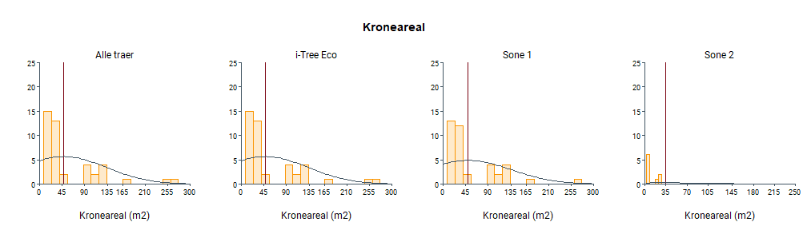

# Sammendragsstatistikk | Registrerte trær i Bodø

Dette dokumentet viser sammendragstatistikken for registrerte trær innenfor Bodø's byggesone. Tilknyttede kartprodukter er synlige i bytræratlaset: [Bytræratlas Bodø](https://experience.arcgis.com/experience/5191adc2c4b34658aea227c9853c6ebb/)

| Gruppe                 | Beskrivelse                                            | Antall             |
|------------------|------------------------------------|------------------|
| Totalt registerte trær | Totalt antall registrerte trær i Bodø | 6184       |
| i-Tree Eco             | Totalt antall trær brukt i i-Tree Eco                  | 6131 |
| Sone 1                 | Trær i forurensnings sone 1 (grønn)                    | 5813    |
| Sone 2                 | Trær i forurensnings sone 2 (gull)                     | 371    |
| Sone 3                 | Trær i forurensnings sone 3 (rød)                      | 0    |
| Totalt trebestand      | Totalt antall trær i bestanden (basert på laserdata)   | 103504     |

 

## Treslagsfordeling i Bodø

Treslag som har en sannsynlighet på mindre enn 3% er klassifisert som "Andre treslag".

\*Treslag klassifisert som 'Andre treslag' er: Alm, Alpeasal, Amerikahagtorn, Anna Art, Ask, Blodbøk, Dunpil, Eple, Gran, Gråor, Gråselje, Gullregn, Hagtorn, Hegg, Hestekastanje, Hvitpil, Istervier, Katsuratre, Kurvpil, Lerk, Morell, Neverhegg, Ornäsbjørk, Prydeple, Rognasal, Rød spisslønn, Rødhyll, Sargentkirsebær, Sitkagran, Spisslønn, Sølvasal, Sølvpil, Tartarlønn, Ukjent, Ullungrogn, Valnøtt 

 

## Tre egenskaper

 

|Treslag         | Antall Trær| Kroneareal (m2)| Høyde (m)| Stammediameter (cm)|
|:---------------|-----------:|---------------:|---------:|-------------------:|
|Alm             |          33|           44.08|     11.69|               29.13|
|Alpeasal        |          34|           38.56|      5.10|               13.67|
|Amerikahagtorn  |           5|           29.16|      5.00|                5.41|
|Anna Art        |          55|           30.76|      6.89|               13.02|
|Ask             |          89|           57.26|     11.20|               29.78|
|Balsampoppel    |         304|           43.22|     12.86|               31.48|
|Bjørk           |        1274|           23.98|      8.95|               17.18|
|Blodbøk         |          29|           39.95|      8.22|               12.51|
|Dunpil          |           1|           52.85|      5.00|                9.55|
|Eple            |           7|           25.57|      6.26|               10.23|
|Furu            |         200|           20.32|     11.38|               29.95|
|Gran            |          22|           35.19|     11.45|               28.94|
|Gråor           |           9|           46.27|      9.56|               29.71|
|Gråselje        |          15|           35.39|      6.57|               16.02|
|Gullregn        |           4|           55.84|      8.04|               22.24|
|Hagtorn         |           4|           22.53|      5.67|                9.55|
|Hegg            |          19|           28.73|      6.35|               11.90|
|Hengebjørk      |         304|           33.23|      9.55|               19.67|
|Hestekastanje   |           3|           99.86|     11.08|               49.87|
|Hvitpil         |           3|           44.37|      8.33|                8.49|
|Istervier       |          29|           21.11|      5.47|                6.42|
|Katsuratre      |           1|           65.76|      5.00|               12.73|
|Kurvpil         |           2|           44.47|      7.50|               12.73|
|Lerk            |         176|           26.60|     14.24|               32.79|
|Morell          |          21|           27.83|      5.64|                4.55|
|Neverhegg       |           3|           34.22|      5.00|                6.37|
|Ornäsbjørk      |          95|           38.46|      5.50|                8.20|
|Osp             |         377|           20.39|      9.98|               19.37|
|Platanlønn      |         262|           52.21|      7.65|               18.88|
|Prydeple        |           5|           24.40|      7.26|                6.37|
|Rogn            |         686|           22.79|      7.29|               12.35|
|Rognasal        |          34|           35.16|      5.68|               10.35|
|Rød spisslønn   |           1|           38.83|      5.00|                6.37|
|Rødhyll         |           4|           20.04|      5.18|                7.56|
|Sargentkirsebær |           8|           27.62|      5.00|                6.37|
|Selje           |         558|           33.12|      8.11|               18.81|
|Sitkagran       |          17|           23.68|      7.91|               15.26|
|Spisslønn       |          31|           51.23|      6.87|               11.40|
|Svensk asal     |         925|           41.54|      7.18|               23.86|
|Syrin           |         456|           17.77|      5.51|                6.09|
|Sølvasal        |           3|           49.59|      5.87|               20.16|
|Sølvpil         |           3|           32.04|      5.00|                6.37|
|Tartarlønn      |           3|           14.94|      5.00|                6.37|
|Ullungrogn      |          16|           31.81|      6.67|                6.37|
|Valnøtt         |           1|           38.83|      5.00|                6.37|

 

## Regulerende økosystemtjenester

\*Treslag med gjennomsnittlig karbonlagring \< 100 kg vises ikke i plottet. 

\*Treslag med årlig karbonbinding \< 5 kg/år vises ikke i plottet. 

\*Treslag med gjennomsnittlig reduksjon av overflateavrenning \< 0.1 m3/år vises ikke i plottet. 

\*Treslag med gjennomsnittlig reduksjon av luftforurensing \< 25 g/år vises ikke i plottet. 

 

|Kroneareal (m2) | Antall Trær| Karbonlagring (kg)| Årlig karbonbinding (kg/år)| Årlig karbonbinding (NKr/år)| CO2-utslipp unngått (kg/år)| CO2-utslipp unngått (NKr/år)| Reduksjon av overflateavrenning (m3/år)| Reduksjon av overflateavrenning (NKr/år)| Reduksjon av luftforurensing (g/år)| Reduksjon av luftforurensing (NKr/år)| Energibesparelse (Nkr/år)| Totalverdi Økosystemtjenester (NKr/år)|
|:---------------|-----------:|------------------:|---------------------------:|----------------------------:|---------------------------:|----------------------------:|---------------------------------------:|----------------------------------------:|-----------------------------------:|-------------------------------------:|-------------------------:|--------------------------------------:|
|0-50            |        5064|             103.27|                        6.09|                        11.46|                        8.73|                        17.75|                                    0.05|                                     0.44|                               21.50|                                 14.62|                    177.10|                                  52.85|
|50-100          |         951|             204.31|                        8.21|                        15.47|                       11.89|                        22.61|                                    0.15|                                     1.17|                               49.05|                                 33.29|                    221.37|                                 101.64|
|100-150         |         102|             469.81|                       12.31|                        23.18|                       18.72|                        35.25|                                    0.20|                                     1.59|                               66.87|                                 45.39|                    338.81|                                 160.11|
|150-200         |          10|             699.60|                       15.30|                        28.79|                        8.73|                        16.39|                                    0.37|                                     2.92|                               88.58|                                 59.86|                    126.39|                                 134.40|
|200-250         |           3|            1758.53|                       19.53|                        36.84|                       61.45|                       115.62|                                    0.20|                                     1.60|                              111.30|                                 75.90|                   1042.30|                                 886.27|
|250-300         |           1|            3160.00|                       50.00|                        94.14|                         NaN|                          NaN|                                    0.20|                                     1.76|                              122.60|                                 83.58|                       NaN|                                 179.49|

 